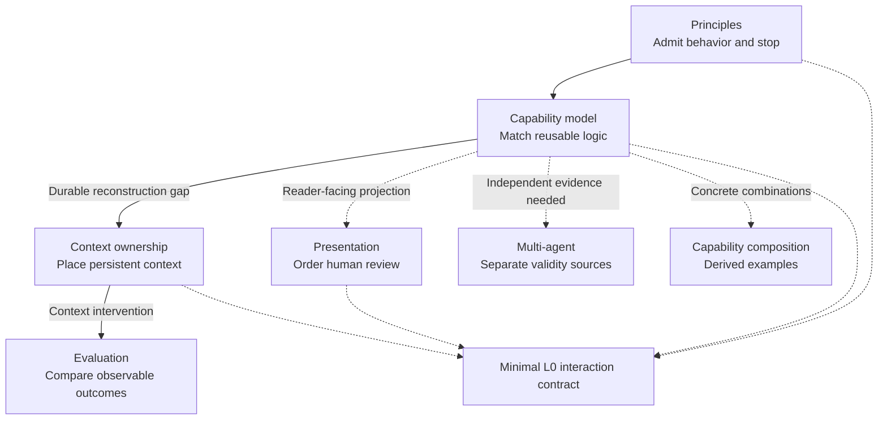

# Organization documentation

This directory routes each public Agentic Tend question to one canonical owner. The map below is a derived navigation view; it does not redefine the linked theories.

New to the project? Start with the [Agentic Tend guide](guide.md), which introduces the design from the pressures that make each part necessary.

## How the files relate

The solid path follows behavior from admission through dispatch and, when needed, persistence and evaluation. Dotted edges are derived views or conditional projections; they do not transfer semantic ownership. The [minimal L0 interaction contract](../config/codex/AGENTS.global.md) projects only the user-specific ambient rules from the public model.

## Find the canonical owner

| When this happens | Read | This file decides | It does not decide |
| --- | --- | --- | --- |
| The agent may be acting without a material need, or may not know when to stop | [Principles](principles.md) | The general pressure threshold for behavior, including the requirement that persistence answer a real need | Which capability performs the work or whether a particular context candidate should persist |
| One task contains several concerns that require different reusable judgments | [Capability model](capability-model.md) | How current task data produces pressure, traits, capability composition, and feedback | Whether a claim is true, an action is authorized, or context should persist |
| Important meaning may be lost or repeatedly reconstructed across tasks | [Context ownership](context-ownership.md) | Whether a particular context candidate should persist and its owner, scope, activation, lifetime, and retrieval boundary | The general pressure threshold, fast task loop, or content of a domain decision |
| A human needs a result without reading every implementation detail | [Presentation and human review](presentation.md) | How task state is projected by reader responsibility and prerequisite order | The validity of the underlying claim or who owns it |
| Shared assumptions could make several agents repeat the same error | [Multi-agent evidence separation](multi-agent.md) | When information separation can create an independent validity source | Capability ownership, authority, or faster execution by itself |
| A proposed persistent rule, skill, or context change may have costs or regressions | [Context evaluation](evaluation.md) | How to compare a context intervention with a baseline on observable outcomes | The general fast loop or all forms of software testing |

[Capability composition](capability-composition.md) gives two derived examples of several operators acting on one task; it owns no additional theory. The [organization roadmap](roadmap.md) tracks changes that cross these owners.

Layer-specific implementation, instructions, and delivery plans remain in their owning repositories.
