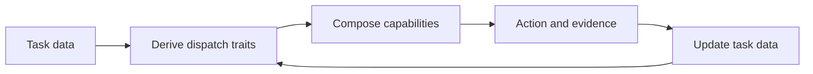

# Agentic tooling

Agentic Tend preserves objectives and preferences that general model capability cannot reliably infer, then places each one at the narrowest justified owner and activation boundary.

## Motivation

Richard Sutton's *The Bitter Lesson*[^bitter-lesson] argues that scalable learning and search ultimately outperform attempts to hand-code human domain knowledge into intelligent systems.

Agentic Tend derives a tooling maxim from that lesson:

> Do not encode intelligence that can be learned; encode objectives and preferences that cannot be inferred.

It does not imply deleting every `AGENTS.md` or skill as models improve. Cross-domain epistemology, personal taste, authority boundaries, local facts, and public contracts remain justified when stronger general capability still cannot infer them.

`Tend` means caring for a growing system: let useful instances expose pressure, introduce only the structure that pressure requires, and preserve the distinctions needed for later judgment.

## Pressure before structure

The governing sequence is:

> observed need -> minimal persistent structure

Minimal means minimum sufficient and lossless, not the fewest files or shortest prose. Apply the same counterfactual discipline to addition and subtraction: persist a distinction only when its absence would change future judgment, move it when its owner or activation boundary is wrong, and compress or delete it only when meaning, rationale, and sources remain recoverable. The [context ownership model](context-ownership.md) owns the operational tests for each migration action.

Generated structure and smaller diffs are evidence only when they improve an observable contract or remove a demonstrated cost.

## Task data and dispatch metadata

Task data includes the request, current files, runtime state, observed evidence, and established contracts. Dispatch traits are metadata derived from that data to select relevant capabilities. Once an action produces new evidence, that evidence joins the task data and the traits are derived again.

Metadata is a view, not a second source of truth. When a summary or classification conflicts with current files or an observed result, update the view from the evidence.

A task can expose several traits at once. The final column applies all six traits to one mixed task: refactor a Julia API and update the docstring required by its contract.

| Trait | Meaning | Example in one mixed Julia refactor |
| --- | --- | --- |
| Object | The state or files involved | The API method, related state, and its docstring |
| Action | The requested transformation or judgment | Refactor behavior and update the durable prose |
| Concern | An independent aspect of the task that requires its own judgment | Software behavior, Julia semantics, and persistent prose |
| Contract | The meaning or observable behavior that must remain true | Public API semantics and failure behavior |
| Evidence | Observations that distinguish success, failure, or competing hypotheses | Focused tests and rendered documentation |
| Uncertainty and authority | What remains unknown and who or what can resolve it | Source resolves implementation facts; the user resolves behavior-changing choices |

Traits describe the task without naming the capabilities selected to handle it. Dispatch matches those descriptive traits against capability predicates.

Whether a derived view should be stored, where durable context belongs, and how it is loaded are separate questions owned by the [context ownership model](context-ownership.md).

## Intellectual influences

The L0 reasoning principles distill several compatible but non-identical traditions:

- Yang Chen-Ning's preference for plain, substantial work, summarized by "宁拙毋巧, 宁朴毋华", supports derivation and robustness over display or tricks. His permeative learning also motivates gradual immersion: continue through partial understanding while increasingly constraining observations connect points into a whole.[^yang-style]
- Grothendieck's rising-sea image describes problems becoming natural as a surrounding conceptual world develops.[^rising-sea] Agentic Tend inherits the preference for structural derivation and gradual immersion, but not unconditional generalization: a larger theory must still answer concrete pressure and state its cost.

Examples across domains

- For **algorithms**, the shared route starts with exhaustive enumeration or the simplest complete baseline, identifies redundant computation, and derives the minimum structure that removes it.
- For **data structures**, it begins with primitive storage and derives a new representation from expensive operations.
- For **mathematics and physics**, it names the obstruction or insufficiency before introducing the concept that resolves it.

These examples realize the same epistemology; they do not define an exhaustive task taxonomy.

## Navigation

- The [development capability model](development.md) shows how several concerns can dispatch together without prescribing a fixed reasoning trajectory.
- The [organization roadmap](roadmap.md) tracks changes that coordinate more than one semantic owner or activation mechanism.

## Evaluation

File presence measures maintenance activity, not whether context improved the task. Treat a context change as an intervention: define the observable outcome first, then test whether the smallest candidate improves representative work.

- State the intended task distribution, success condition, and stopping evidence before inspecting outputs.
- Form a working hypothesis and compare the smallest context candidate with a baseline using the cheapest evidence that distinguishes the live alternatives.
- Use model or human judgment for semantic outcomes and executable checks for mechanical conditions; calibrate automated proxies against human judgment.
- Preserve enough evidence to distinguish a wrong implementation from an invalid check, environment drift, or noise, then retain confirmed failures as regression cases.
- Distill a new instruction or add enforcement only after repeated misses justify its maintenance and no material regression appears on adjacent tasks.

Scenario evaluations are one practical implementation of this method.[^scenario-evaluations]

[^bitter-lesson]: Richard Sutton, [*The Bitter Lesson*](http://www.incompleteideas.net/IncIdeas/BitterLesson.html).
[^yang-style]: Tsinghua documents Yang's [permeative learning](https://www.tsinghua.edu.cn/info/3225/121939.htm) and [plain research style](https://www.tsinghua.edu.cn/info/3225/121987.htm).
[^rising-sea]: McLarty's [*The Rising Sea*](https://ncatlab.org/nlab/files/McLartyRisingSea.pdf) documents Grothendieck's method.
[^scenario-evaluations]: The [Tessl documentation](https://docs.tessl.io/) describes [scenario evaluations](https://docs.tessl.io/improving-your-skills/evaluate-skill-quality-using-scenarios). It is a practical reference, not a project dependency or adopted benchmark.
