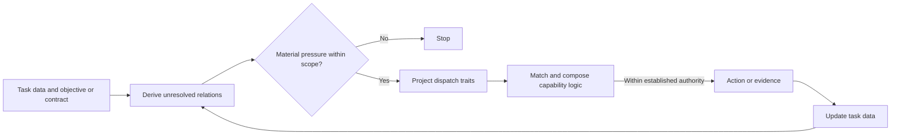

# Capability model

The capability model owns the fast loop that derives needed behavior from current task data and revises that behavior when evidence changes the state.

## Task-data feedback loop

Task data includes the request, current artifacts, runtime state, observed evidence, and established objectives, contracts, and authority. Pressure is a derived unresolved relation between that data and what the task requires. It determines whether behavior is needed only when resolving it could change the current judgment, outcome, or authorized next action.

Pressure is a temporary relation in the data plane. A missing fact, suspected defect, or proposed risk remains a hypothesis until its proper validity source supports it. Pressure may justify a probe, while the resulting evidence and established authority decide the answer and permitted action.

Evidence produced by an authorized action returns to task data. Pressure and dispatch traits are then derived again, so the composition may continue, change, request a user-owned decision, or stop. This is the only general fast loop in the public model.

## Keep task state separate from reusable logic

Task data holds the current state of the work: the request, artifacts, runtime observations, evidence, contracts, and authority. Each item retains its own validity source rather than becoming true because the harness stored it.

Pressure and dispatch traits are temporary views derived from that state. Pressure explains why behavior may be needed now; traits describe the features relevant to choosing logic. Task data remains the fact store, and both views are derived again when the state changes.

Capability interfaces and capability logic hold reusable judgment. An interface states the traits that select the logic and any adjacent case that requires another route; the logic supplies the applicable reasoning or realization. Facts, contracts, and authority retain their sources in task data.

An authorized action produces a result or evidence. That evidence returns to task data, where it can remove the pressure, change the required capability composition, expose a user-owned choice, or justify another action. Each contributed decision retains its semantic owner.

## Generative dispatch

Traits form an open projection of current task data. Depending on the task, useful traits may describe the operated object, requested action, independent concern, governing contract, evidence need, uncertainty, authority boundary, or another feature that distinguishes applicable logic.

The same object can create different pressure and therefore dispatch different capabilities. Several independent concerns on one object can compose several capabilities. Dispatch supplies applicable logic, while facts, contracts, authorization, and test results remain task data from their proper sources.

One agent may compose several capabilities, and one capability may be used in several contexts. When information separation can create another validity source, the [multi-agent evidence model](multi-agent.md) may project temporary agent ports over the same task data. Human-facing ordering remains owned by the [presentation model](presentation.md), while persistence and activation remain owned by [context ownership](context-ownership.md). Two concrete compositions appear in [capability composition](capability-composition.md).

## Bounded pattern-matching and compiler profiles

Pattern matching describes the dispatch edge: current task data is projected into traits, then matched against open capability interfaces that can grow with new distinguishing pressure.

One iteration can also be viewed as a probabilistic, compiler-like transformation from task data and capability interfaces to an answer, artifact, tool action, or evidence. Its input and output may occupy different abstraction levels, while semantic correctness comes from the task's proper validity sources. Research systems that use compiler-inspired orchestration or prompt compilation support this transformation view.[^llmcompiler][^dspy][^lmql][^grammar-decoding]

Across iterations, observations, computation, action, and returned evidence form a closed loop. Feedback theory supports that general topology; it does not establish stability, convergence, or optimality for this harness.[^feedback-systems]

[^llmcompiler]: Kim et al., [*An LLM Compiler for Parallel Function Calling*](https://proceedings.mlr.press/v235/kim24y.html), ICML 2024.
[^dspy]: Khattab et al., [*DSPy: Compiling Declarative Language Model Calls into Self-Improving Pipelines*](https://arxiv.org/abs/2310.03714), 2023.
[^lmql]: Beurer-Kellner et al., [*Prompting Is Programming: A Query Language for Large Language Models*](https://arxiv.org/abs/2212.06094), 2022.
[^grammar-decoding]: Geng et al., [*Grammar-Constrained Decoding for Structured NLP Tasks without Finetuning*](https://aclanthology.org/2023.emnlp-main.674/), EMNLP 2023.
[^feedback-systems]: Åström and Murray, [*Feedback Systems: An Introduction for Scientists and Engineers*](https://authors.library.caltech.edu/records/yzs24-xsx88), introduces closed-loop feedback as sensing, computation, and actuation. Agentic Tend borrows only this general topology.
