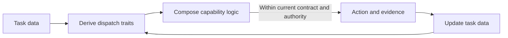

# Capability model

The capability model derives composable behavior from current task data without turning metadata, skills, or orchestration into parallel sources of truth.

## Task data and feedback

Task data includes the request, current files, runtime state, observed evidence, and established contracts. Dispatch traits are metadata derived from that data to select relevant capabilities. Once an action produces new evidence, that evidence joins the task data and the traits are derived again.

Metadata is a view, not a second source of truth. When a summary or classification conflicts with current files or an observed result, update the view from the evidence.

The invariant is that task state remains in the data plane, skills hold composable logic, and descriptive metadata connects the two without becoming another fact store. Modularity keeps each capability's reusable logic within its own maintenance and validity boundary; composability exposes the same capability boundary as ports over shared task data, evidence, and contracts.

## Primitive topology

| Primitive | Ontology | Validity source | Relation |
| --- | --- | --- | --- |
| Task data | The current request, files, runtime state, evidence, and contract | The observed system | Traits read it; evidence updates it |
| Derived trait | A descriptive metadata projection from current task data[^dispatch-trait-projection] | Current task data | Participates in dispatch without becoming a fact source |
| Capability interface | Reusable logic's activation predicate and negative boundary | `SKILL.md` frontmatter | Matches derived traits |
| Capability logic | Reusable judgment or workflow loaded after activation | `SKILL.md` body, references, and scripts | Consumes task data and produces action or evidence |
| Composition seam | A connection through which capabilities share data without merging validity owners | Capability interfaces and the active contract | Enables modularity and composability together |
| Semantic owner | The authority that decides why a durable meaning is valid | This repository, a skill, a target repository, or the user | Other consumers navigate to it or derive a view |
| Mechanical oracle | An executable check for a decidable predicate | A test, hook, CI job, build, or renderer | Produces evidence without owning non-mechanical rationale |
| UI projection | Human-facing discovery and explicit-invocation metadata | `agents/openai.yaml` | Projects an interface without owning semantics |
| Topology | The primitives and their legal edges: the relational part of the meta-ontology | This canonical model | A concrete capability collection instantiates it |

## Dispatch traits

A task can expose several traits at once. The final column applies all six traits to one mixed task: refactor a Julia API and update the docstring required by its contract.

| Trait | Meaning | Example in one mixed Julia refactor |
| --- | --- | --- |
| Object | The state or files involved | The API method, related state, and its docstring |
| Action | The requested transformation or judgment | Refactor behavior and update the durable prose |
| Concern | An independent aspect of the task that requires its own judgment | Software behavior, Julia semantics, and persistent prose |
| Contract | The meaning or observable behavior that must remain true | Public API semantics and failure behavior |
| Evidence | Observations that distinguish success, failure, or competing hypotheses | Focused tests and rendered documentation |
| Uncertainty and authority | What remains unknown and who or what can resolve it | Source resolves implementation facts; the user resolves behavior-changing choices |

Traits describe the task without naming the capabilities selected to handle it. Dispatch matches those descriptive traits against capability predicates.

A derived trait can indicate that an authority, contract, or evidence concern is relevant, but it cannot establish the underlying authorization, contract, fact, or test result. Capability dispatch makes logic applicable; an action remains bounded by the current task data and each claim's own validity source.

Whether a derived view should be stored, where durable context belongs, and how it is loaded are separate questions owned by the [context ownership model](context-ownership.md). Human-facing projection and review are owned by the [presentation model](presentation.md).

## Capability and agent composition

The capability graph describes which reusable judgment current task traits require. When evidence separation is useful, an agent-port graph and its feedback topology form a transient execution projection over the same task data. They do not extend the primitive ontology or establish a new source of truth.

This is an effective description of black-box execution. It retains port motivation, inputs, outputs, withheld information, feedback edges, provenance, and human-visible projections while leaving agent count, prompts, private reasoning, message order, and local decomposition to the active model and runtime.

One agent may compose several capabilities, and one capability may contribute to several independently scoped contexts. Coordinator, prior-evidence, worker, and posterior-review ports are conditional realizations derived from the current claim, uncertainty, information boundary, and evidence need; they are not persistent roles, exclusive task owners, or required stages. The [multi-agent evidence model](multi-agent.md) owns when and why this effective separation can reduce correlated failure.

## Bounded compiler analogy

Several research systems justify a bounded compiler analogy: LLMCompiler separates planning, task fetching, and execution in compiler-inspired tool orchestration; DSPy compiles declarative LM modules into metric-optimized pipelines; LMQL compiles prompt, control flow, and output constraints into an inference procedure; and grammar-constrained decoding mechanically restricts output structure.[^llmcompiler][^dspy][^lmql][^grammar-decoding] None establishes that an LLM is literally a compiler or that structural conformance proves semantic correctness.

Agentic Tend therefore makes this project inference:

> Harness orchestration can be modeled as a probabilistic, compiler-like transformation from task data and capability interfaces to actions. Model capability supplies open-ended selection and synthesis; tests, tools, schemas, permissions, and human authority constrain only the predicates they can actually decide.

[^llmcompiler]: Kim et al., [*An LLM Compiler for Parallel Function Calling*](https://proceedings.mlr.press/v235/kim24y.html), ICML 2024.
[^dspy]: Khattab et al., [*DSPy: Compiling Declarative Language Model Calls into Self-Improving Pipelines*](https://arxiv.org/abs/2310.03714), 2023.
[^lmql]: Beurer-Kellner et al., [*Prompting Is Programming: A Query Language for Large Language Models*](https://arxiv.org/abs/2212.06094), 2022.
[^grammar-decoding]: Geng et al., [*Grammar-Constrained Decoding for Structured NLP Tasks without Finetuning*](https://aclanthology.org/2023.emnlp-main.674/), EMNLP 2023.
[^dispatch-trait-projection]: Here projection means a metadata view derived from task data, distinct from UI or human-facing presentation. It is analogous only to the shape commonly called Julia's Holy-trait idiom: an ordinary query projects a value or type to a dispatch marker; Julia documents `IndexStyle` as a [traits-based mechanism](https://docs.julialang.org/en/v1/manual/interfaces/#man-interface-array). It is not a Rust native trait or associated-type projection: a Rust [trait](https://doc.rust-lang.org/stable/reference/items/traits.html) declares an abstract interface implemented through `impl`, with overlap and orphan constraints enforced through [trait implementation coherence](https://doc.rust-lang.org/stable/reference/items/implementations.html#trait-implementation-coherence). Agentic Tend borrows only the partial mapping `task data -> metadata marker -> dispatch`; it does not claim Julia method-selection semantics, Rust `impl` coherence, or that dispatch itself produces capability composition.
