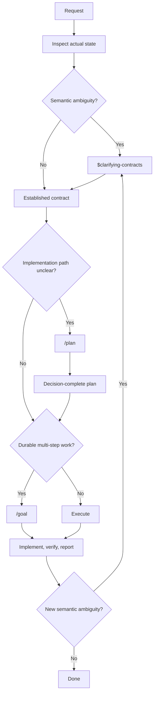

# Development routing

This human-facing model routes uncertainty before implementation and maps Agentic Tend's development philosophy onto Codex primitives.

## Routing model

The fenced Mermaid diagram is the only flowchart source. GitHub renders it natively; do not maintain a synchronized ASCII version. See [Creating diagrams](https://docs.github.com/en/get-started/writing-on-github/working-with-advanced-formatting/creating-diagrams).

## Uncertainty boundaries

- Route user-owned semantic ambiguity to [`$clarifying-contracts`](https://github.com/agentic-tend/skills/tree/main/clarifying-contracts) before implementation.
- Use `/plan` for implementation-path uncertainty after the outcome and public contract are clear. A plan does not substitute for a semantic contract.
- Use `/goal` only for durable multi-step work whose outcome, constraints, and completion evidence are already defined.
- Return to the contract when execution exposes new semantic ambiguity.
- Return to architecture or planning when implementation exposes a wrong abstraction, a failing topology, or repeated local correction.

The Codex [long-running work](https://learn.chatgpt.com/docs/long-running-work) guidance describes `/plan` and `/goal`; this model adds the contract boundary in front of those primitives.

## Roles

Use a four-role loop for nontrivial development work where the role boundary is based on uncertainty type:

- Human: goal alignment, taste, final empirical acceptance
- Exploration agent: knowledge-surface uncertainty and path exploration
- Architecture reviewer: topology, contracts, documentation boundaries
- Execution agent: executable identity, local API details, tests, and concrete diffs

These are uncertainty roles, not a required number of agents. One agent may occupy several roles sequentially. The pipeline is allowed to iterate.

- If implementation exposes a wrong abstraction or repeated failure, return to *the Architecture reviewer*;
  - accepted lessons update the appropriate contract, decision, test, or rule.
- If architecture review exposes missing theory or package-level uncertainty, return to *the Exploration agent*.
- If exploration produces multiple plausible routes, the Human selects or rejects based on project taste and observed cost.

## Exploration and Brainstorming

Exploration is a role for knowledge-surface uncertainty: theory, domain facts, existing methods, and dependency ecosystems.

Brainstorming is a procedure for design uncertainty: use dialogue and human review to clarify goals, constraints, alternatives, and acceptance criteria. Any role or tool may perform it.

Exploration may supply evidence to brainstorming and may recur when architecture review exposes a knowledge gap.

## Change control

- Update this model when organization-level uncertainty routing or role boundaries change.
- Update global `AGENTS.md` or a skill only when its executable behavior changes.
- Keep public layer and ownership theory in [agentic tooling](agentic-tooling.md) and [context ownership](context-ownership.md); keep the human development-process model here.
- Keep transient execution state in prompts, plans, goals, issues, pull-request bodies, commits, or test failures rather than this durable model.
