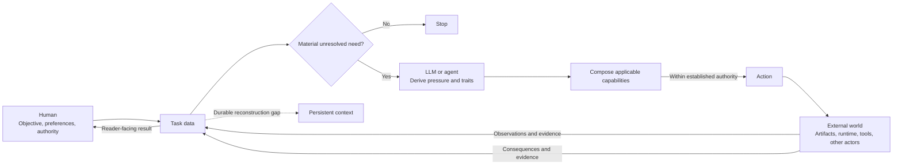

# Agentic Tend guide

Agentic Tend helps a human use an LLM to act on the external world while keeping factual and decision authority at their proper sources. This guide explains why each part of the design exists. It is a teaching view; the linked documents remain the canonical owners of the rules.

## Three participants

| Participant | Provides | Boundary |
| --- | --- | --- |
| Human | Objectives, preferences, constraints, and authorization | Authority over choices that would change the intended outcome or permitted action |
| LLM or agent | Open-ended inference, capability matching, and execution | It must inspect discoverable facts and stay within the established contract and authority |
| External world | Artifacts, runtime state, tools, other actors, and action consequences | Observed state and evidence outrank an agent's account of them |

These participants are not instances of one agent abstraction. They have different roles in the interaction. Agentic Tend's instructions and capability interfaces preserve those boundaries while giving the LLM enough freedom to match its behavior to the task. The harness is those persistent mechanisms together with their retrieval and routing. It conditions the interaction but is not a fourth participant.

## One interaction loop

Task data is the current, source-grounded state of the work. A pressure is an unresolved relation within that state whose resolution could change the judgment, result, or authorized next action. Traits describe where that pressure occurs so the LLM can select reusable capability logic. Returned evidence changes task data, so the LLM must derive the remaining pressure again. Capability matching never turns a hypothesis into a fact or creates authority. The canonical loop is [Task-data feedback loop](capability-model.md#task-data-feedback-loop); the diagram above adds the three participants as a teaching projection.

## Why each design exists

### A capable model can keep acting

Generation is cheap, so an agent can continue adding checks, prose, abstractions, or files after the task no longer needs them. Agentic Tend admits behavior only for a material, task-grounded pressure and stops when none remains within scope. The same threshold applies to persistence: adding durable structure must answer a pressure rather than a routine. The canonical rules are in [Pressure before behavior](principles.md#pressure-before-behavior) and [Fast behavior and slow persistence](principles.md#fast-behavior-and-slow-persistence). Applying that threshold to a particular context candidate belongs to context ownership below.

### One task can need several kinds of judgment

A single artifact may raise independent questions about software behavior, scientific evidence, prose, and authorization. Assigning the whole task to one category either hides those differences or requires an ever-growing taxonomy. The capability model instead derives non-exhaustive traits from current task data and composes the applicable logic. [Generative dispatch](capability-model.md#generative-dispatch) owns this decision.

### Some meaning must survive the task

An LLM can infer many local facts again, but objectives, preferences, authority boundaries, and repository-specific decisions may be lost or reconstructed incorrectly. For a particular context candidate, context ownership tests whether that durable reconstruction gap justifies persistence. [The persistence loop](context-ownership.md#persistence-loop) owns that decision, while [placement and cache view](context-ownership.md#placement-and-cache-view) decides where the accepted context belongs and when it should load.

### Human review is the scarce resource

An agent can produce more detail than a human can inspect. A useful answer therefore exposes the smallest result needed for the reader's current responsibility, then reveals motivation, mechanism, and evidence in prerequisite order. This changes presentation, not the underlying validity of a claim. [The three presentation axes](presentation.md#three-independent-axes) own that projection.

### More agents can repeat the same mistake

Parallel agents that inherit the same assumptions often reproduce one correlated error. Another context is useful only when information separation can create an independent evidence source or a held-out falsification attempt. [Activation and stopping](multi-agent.md#activation-and-stopping) owns that boundary.

### Persistent context can fail

A rule or skill is an intervention: it may improve one task while adding retrieval cost, false activation, or regressions elsewhere. Compare the smallest candidate with a baseline on observable outcomes rather than treating the new file as success. [Define the observable outcome](evaluation.md#define-the-observable-outcome) owns this evaluation.

## How to use the model

### As a user

State the outcome, relevant constraints, and any action you reserve for yourself. Provide the artifacts or external state that can decide the task. The LLM should inspect discoverable facts, expose the smallest useful result first, and return only unresolved choices that could materially change the contract. You do not need to select a capability for it.

### As a harness maintainer

Begin with an observed failure or repeated reconstruction cost. Ask whether the current model and artifacts could already infer the missing behavior. If not, identify the canonical owner, the narrowest activation boundary, and the minimum persistent intervention. Then evaluate the resulting behavior and remove the intervention if the pressure disappears.

### When explaining Agentic Tend

Start with the pressure and show the response it generates. Add a boundary when current task data contains a live adjacent action or interpretation that can change judgment, and route each remaining decision to its canonical owner. The [documentation map](README.md) provides one-jump routing, and [capability composition examples](capability-composition.md) show how several owners can act on one task.
