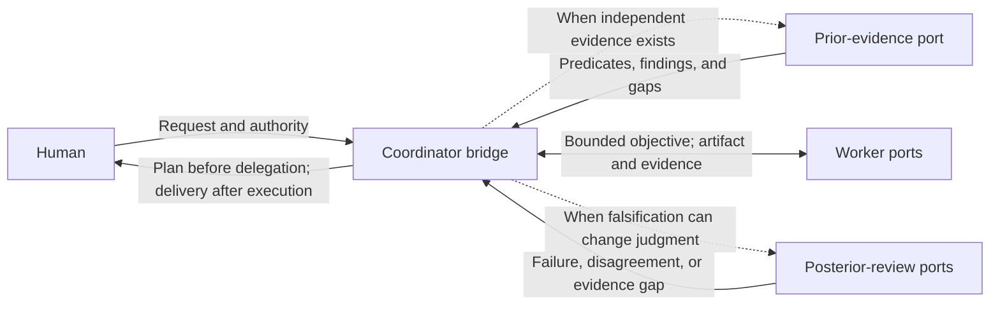

# Multi-agent evidence separation

Multi-agent evidence separation treats agent execution as a black box and specifies only the observable ports and feedback topology needed to produce independently useful evidence.

## Why: correlated failure and review bandwidth

AI can produce implementation, analysis, tests, and review transcripts faster than a human can inspect them. Adding agents without changing what they see or how they form claims increases this volume while often preserving the same assumptions, framing, and blind spots. Several agents repeating one narrative and then voting on it create correlated repetition, not independent evidence.

The useful objective is therefore not more agents or more debate. It is to let a meaningfully separated context expose a plausible failure through its own validity sources or method, then return only the distinctions that can change judgment. Evidence separation addresses correlated failure; progressive disclosure prevents the resulting evidence from becoming a new human-review burden.

## Without orchestration: an effective boundary

`Without orchestration` does not mean that coordination disappears. It means that durable context models the effective behavior visible at task boundaries instead of prescribing an agent's inaccessible micro-trajectory.

| Retain in the effective contract | Leave to the active model and runtime |
| --- | --- |
| Human-visible plan and delivery | Agent count, names, and internal role graph |
| Port motivation, inputs, outputs, and withheld information | Prompts, private reasoning, and local decomposition |
| Feedback edges, stopping evidence, and provenance | Message order, scheduling, and tool trajectory |
| Validity sources, authority boundaries, and audit gaps | Contract-equivalent implementation choices |

This boundary preserves non-inferable preferences without spending context on an imitation of the reasoning that a capable model must perform anyway. It also avoids collapsing the solution space into a fixed supervisor pipeline. The capability graph remains the durable description of reusable judgment; an agent-port graph and its feedback edges are temporary views derived from current task data.

Before assigning ports, define the smallest object-specific evidence boundary: the claim at issue, its proper validity sources, each port's inputs and withheld information, and the output that can change judgment. Each port may then choose its local realization. This dependency does not prescribe runtime order or forbid feedback from revising the port graph.

## Observable port topology

When evidence separation applies, a coordinator bridges the human boundary while other ports appear only when their motivation exists.

| Port | Motivation | Consumes | Produces |
| --- | --- | --- | --- |
| Coordinator bridge | Preserve human attention and authority while maintaining the effective feedback topology | Request, established contract, task data, authority, and returned evidence | Human-visible plan and delivery, bounded port interfaces, feedback routing, and stopping state |
| Prior-evidence port | Prevent implementation exposure from moving an independently available target | Motivation, observable contract, current facts, and applicable validity sources, without the proposed implementation when independence matters | Supported mechanical predicates, judgment-changing findings, and explicit unvalidated boundaries |
| Worker port | Realize one bounded objective without becoming a new semantic owner | Objective, contract, authoritative facts, allowed actions, and applicable capabilities | Artifact or claim, observations, evidence, provenance, and unresolved boundaries |
| Posterior-review port | Find discriminating failures and compress review before human attention is required | Resulting artifact, contract, evidence, and executable environment, without an unnecessary success narrative | Counterexample, disagreement, evidence gap, or bounded support with its provenance |

These are conditional ports, not persistent agent identities or mandatory stages. The coordinator is present once multi-agent execution is activated because it owns the human bridge. Prior-evidence and posterior-review ports are omitted when their motivation is absent, and any port may be realized by one or more temporary contexts without changing the semantic owner of its work.

## Evidence before implementation

A prior-evidence port exists only when valid evidence can be formed independently and seeing the implementation could contaminate it. Its output distinguishes three boundaries:

- a **mechanical predicate** is included only when the property is both decidable by the available oracle and worth checking;
- a judgment-changing finding traces the outcome back to motivation, contract, evidence, or human authority so drift, omission, and redundancy can be examined;
- an **unvalidated claim** records what no available source or probe can decide.

An interpretation is not a mechanical oracle, and an agent's judgment that an artifact satisfies a semantic requirement remains a claim. Tasks that are not meaningfully verifiable do not acquire fabricated tests or evaluator roles.

For software work, tests may project applicable mechanical predicates, but software testing, implementation topology, and oracle integrity remain owned by the software-engineering capability. Multi-agent separation decides only whether those judgments benefit from a context that has not seen the proposed implementation.

## Recursive posterior review

Posterior review filters local detail before it consumes human bandwidth. The analogy to an L1-L2-L3 hierarchy is limited: a cheaper local layer absorbs frequent checks, while a miss, conflict, or uncertainty escalates with provenance. It does not prescribe three levels, fixed reviewers, or a universal review depth.

Each layer forwards only distinctions that can change the next reader's judgment, while keeping accessible artifacts and evidence reachable. The number and depth of layers grow from current failure hypotheses, evidence cost, and authority rather than a risk ontology.

Agreement means that current claims and observations are compatible. It is evidence of consistency, not proof of correctness. Shared models, sources, specifications, and tools can still create common-mode failure.

When ports disagree, route the disputed claim to the cheapest validity source or probe that can distinguish the live alternatives. A user-owned semantic choice returns to the user. If no available evidence can resolve a claim, retain it as unvalidated rather than letting the coordinator or a vote reconcile it by intuition.

## Activation and stopping

Activate this model only when another context can produce independently useful evidence, keep evidence held out from implementation, or perform posterior falsification without inheriting the success narrative. Importance, task size, requested agent count, or latency-only parallelism do not create this evidence boundary.

New observations update task data, so the coordinator may re-derive, combine, repeat, or retire ports. It manages the feedback topology and applies the established stopping contract; it does not own the truth of the claims it transports. Stop when the contract has sufficient evidence from its proper validity sources and no material unresolved conflict remains within the authorized scope.

The [presentation model](presentation.md#multi-agent-plan-and-delivery) owns the human-visible plan and delivery. Accessible files, tool outputs, and lane evidence should be exposed through provenance pointers. If the runtime cannot expose an underlying transcript or artifact, report that audit gap rather than claiming complete traceability or adding a transcript store.

## Runtime boundary

Fresh contexts reduce direct anchoring but do not make agents statistically independent. Independence improves only when information boundaries, methods, tools, or validity sources can distinguish a plausible failure.

Codex subagent contexts and thread coordination, DeepSeek Harness components, and Cordis lifecycle composition are possible runtime mechanisms for this effective model.[^codex-subagents][^deepseek-harness][^cordis] Runtime composability alone does not establish epistemic independence or semantic correctness.

[^codex-subagents]: OpenAI, [*Subagents*](https://learn.chatgpt.com/docs/agent-configuration/subagents).
[^deepseek-harness]: DeepSeek AI, [*DeepSeek Harness*](https://github.com/deepseek-ai/deepseek-harness). The project describes its current release as a rapidly changing developer preview.
[^cordis]: Cordiverse, [*A Programming Paradigm for Spatiotemporal Composability*](https://github.com/cordiverse/paper), draft of August 13, 2026.
