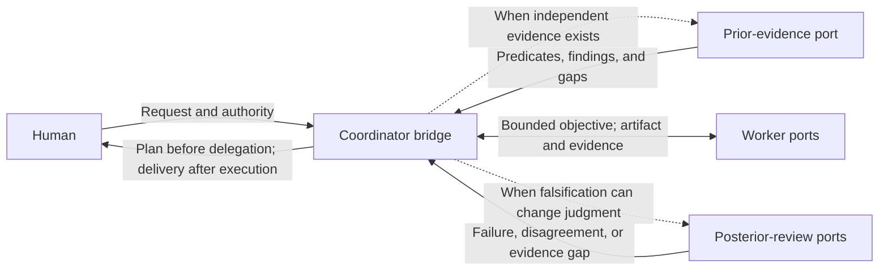

# Multi-agent evidence separation

Multi-agent evidence separation specifies the observable ports and feedback topology needed to produce independently useful evidence across opaque agent contexts.

## Why: correlated failure and review bandwidth

AI can produce implementation, analysis, tests, and review transcripts faster than a human can inspect them. Contexts that share the same inputs and claim-forming method preserve the same assumptions, framing, and blind spots while increasing this volume.

The useful objective is to let a meaningfully separated context expose a plausible failure through its own validity sources or method, then return the distinctions that can change judgment. Evidence separation addresses correlated failure; progressive disclosure keeps the resulting evidence within human review bandwidth.

## Effective boundary

Durable context models the effective behavior visible at task boundaries. The active model and runtime realize the private trajectory that connects those boundaries.

| Retain in the effective contract | Leave to the active model and runtime |
| --- | --- |
| Human-visible plan and delivery | Agent count, names, and internal role graph |
| Port motivation, inputs, outputs, and withheld information | Prompts, private reasoning, and local decomposition |
| Feedback edges, stopping evidence, and provenance | Message order, scheduling, and tool trajectory |
| Validity sources, authority boundaries, and audit gaps | Contract-equivalent implementation choices |

This boundary preserves non-inferable preferences and leaves contract-equivalent reasoning to the active model. The capability graph remains the durable description of reusable judgment; an agent-port graph and its feedback edges are temporary views derived from current task data.

Before assigning ports, define the smallest object-specific evidence boundary: the claim at issue, its proper validity sources, each port's inputs and withheld information, and the output that can change judgment. Each port then chooses its local realization, and returned feedback may revise the port graph.

## Observable port topology

When evidence separation applies, a coordinator bridges the human boundary while other ports appear only when their motivation exists.

| Port | Motivation | Consumes | Produces |
| --- | --- | --- | --- |
| Coordinator bridge | Preserve human attention and authority while maintaining the effective feedback topology | Request, established contract, task data, authority, and returned evidence | Human-visible plan and delivery, bounded port interfaces, feedback routing, and stopping state |
| Prior-evidence port | Prevent implementation exposure from moving an independently available target | Motivation, observable contract, current facts, and applicable validity sources, without the proposed implementation when independence matters | Supported mechanical predicates, judgment-changing findings, and explicit unvalidated boundaries |
| Worker port | Realize one bounded objective without becoming a new semantic owner | Objective, contract, authoritative facts, allowed actions, and applicable capabilities | Artifact or claim, observations, evidence, provenance, and unresolved boundaries |
| Posterior-review port | Find discriminating failures and compress review before human attention is required | Resulting artifact, contract, evidence, and executable environment, without an unnecessary success narrative | Counterexample, disagreement, evidence gap, or bounded support with its provenance |

These ports appear from current evidence pressure. The coordinator owns the human bridge once multi-agent execution is active. Prior-evidence and posterior-review ports appear with their stated motivation, and one or more temporary contexts may realize a port while its work retains the selected capability's semantic owner.

## Evidence before implementation

A prior-evidence port exists only when valid evidence can be formed independently and seeing the implementation could contaminate it. Its output distinguishes three boundaries:

- a **mechanical predicate** is included only when the property is both decidable by the available oracle and worth checking;
- a judgment-changing finding traces the outcome back to motivation, contract, evidence, or human authority so drift, omission, and redundancy can be examined;
- an **unvalidated claim** records what no available source or probe can decide.

An interpretation produces a claim. A mechanical oracle produces a decidable observation. Semantic requirements retain the support status supplied by their proper validity source, including an explicit unvalidated state when no available source can decide them.

For software work, tests may project applicable mechanical predicates. The software-engineering capability owns software testing, implementation topology, and oracle integrity, while multi-agent separation decides whether those judgments benefit from a context that has not seen the proposed implementation.

## Recursive posterior review

Posterior review filters local detail before it consumes human bandwidth. A cheaper local layer absorbs frequent checks, while a miss, conflict, or uncertainty escalates with provenance.

Each layer forwards distinctions that can change the next reader's judgment while keeping accessible artifacts and evidence reachable. Current failure hypotheses, evidence cost, and authority determine the number and depth of layers.

Agreement records compatibility among current claims and observations. It supports consistency within the compared inputs and methods. Correctness remains attached to the proper validity sources, including any shared model, source, specification, or tool that can create common-mode failure.

When ports disagree, route the disputed claim to the cheapest validity source or probe that can distinguish the live alternatives. A user-owned semantic choice returns to the user. An unresolved claim retains an unvalidated status and its provenance.

## Activation and stopping

Activate this model when another context can produce independently useful evidence, keep evidence held out from implementation, or perform posterior falsification without inheriting the success narrative.

New observations update task data, so the coordinator may re-derive, combine, repeat, or retire ports. It manages the feedback topology and applies the established stopping contract. The transported claims retain their proper validity sources. Stop when the contract has sufficient evidence from those sources and no material unresolved conflict remains within the authorized scope.

The [presentation model](presentation.md#multi-agent-plan-and-delivery) owns the human-visible plan and delivery. Accessible files, tool outputs, and lane evidence appear through provenance pointers. An unavailable underlying transcript or artifact produces an explicit audit gap.

## Runtime boundary

Fresh contexts reduce direct anchoring. Information, method, tool, or validity-source boundaries increase epistemic separation to the extent that they enable a distinct failure probe. Statistical independence is established by an applicable model and evidence.

Codex subagent contexts and thread coordination, DeepSeek Harness components, and Cordis lifecycle composition are possible runtime mechanisms for this effective model.[^codex-subagents][^deepseek-harness][^cordis] Their information boundaries and validity sources determine the failure probes they can contribute.

[^codex-subagents]: OpenAI, [*Subagents*](https://learn.chatgpt.com/docs/agent-configuration/subagents).
[^deepseek-harness]: DeepSeek AI, [*DeepSeek Harness*](https://github.com/deepseek-ai/deepseek-harness). The project describes its current release as a rapidly changing developer preview.
[^cordis]: Cordiverse, [*A Programming Paradigm for Spatiotemporal Composability*](https://github.com/cordiverse/paper), draft of August 13, 2026.
